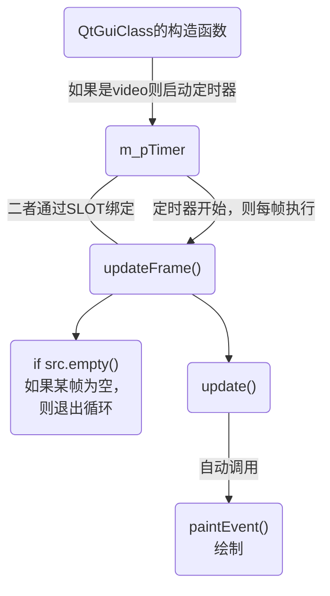

[toc]

# 配置

## DirectX && hlsl

win10自带sdk，无须刻意配置。

WICTextureLoader.h等其它需要的文件以及加入到了工程中。

## opencv

ref: https://www.cnblogs.com/linshuhe/p/5764394.html

我用的3.4.2

## QT5.11.2

我用的是vs2017，ide及工程配置参考：

https://www.jianshu.com/p/ac22d511aea6

https://www.geek-share.com/detail/2768392801.html

# 工程逻辑

## 每帧更新

用SLOT将updateFrame()和m_pTimer定时器绑定到一起。实现每20ms调用一次updateFrame()。

然后呢，updateFrame末尾有调用update()，

update()是qwidget.h里面的函数，是qt中每帧刷新的函数，它和h1s1.cpp中的show()函数都会自动调用paintEvent()函数。

paintEvent()函数是被靳悦重写过的。

## 逻辑图




# 将Kinect配置到此工程

## 简述

本来想将靳悦的工作加到之前的Kinect+socket的工程，后来觉得靳悦的工程比较难移植，所以就把Kinect+socket配置到靳悦的工程。

## 配置


## 工程更改

### 添加新按钮SelectKinectButton

以及它的响应函数

### 重载构造函数QtGuiClass()

从Kinect中取第一帧。

### 根据槽函数updateFrame()添加新的槽函数updateFrame_Kinect()

实现每帧从Kinect中取图片到src

### 修改paintEvent()

添加ifKinect判断

### 修改hlsl1.cpp的构造函数

在最前面加上初始化Kinect

### 添加控制Kinect的cpp和.h：myKinect

### 添加socket

### 将靳悦对“蓝色背景”问题的修改整合到项目

问题：抠像以后显示、导出的前景视频背景为蓝色；

产生原因：去除绿色溢出的作用+DX默认不显示alpha通道；

解决方案：加入DX混合状态设置；

具体修改地方：
1. QtGuiClass.cpp文件中构造函数( ==自己重载的构造函数也要修改哦== )中的bgcolor颜色修改为默认白色_全1；
2. QtGuiClass.cpp文件中InitResource()函数最后添加了混合状态参数的设置；
	.h中添加
	D3D11_BLEND_DESC blendDesc;
	ComPtr<ID3D11BlendState> BSAlphaToCoverage;	// 混合状态：Alpha-To-Coverage
3. QtGuiClass.cpp文件中paintEvent()函数添加了一行`/*设置渲染状态--开启混合模式*/`的代码；

### 添加“Kinect获取一帧”按钮，实现功能：点此按钮能从Kinect中获得一帧，呈现在ui界面上，以供背景色选取。

添加on_getOneFrameButton_clicked()函数

### 将发送RGB改为发送RGBA。
  - 还需修改ue4工程中的TCPServerActor.cpp。（接收大小）

### 解决`Kinect盒子上的浅绿被抠除`问题

- 问题描述：图片和视频都没问题（Kinect盒子上的浅绿可以被抠除），但是处理Kinect流的结果没有完成抠像（Kinect盒子上的浅绿变成了深绿）。
- 解决：重载的构造函数里面的bgcolor忘了改成1。

### 2021/1/27 添加gamma校正、对比度增强。以缓解雪花屏问题。

近期添加了gamma校正+亮度对比度增强+锐化功能(锐化功能效果上暂时有些问题，先不讨论)
1.添加新的着色器代码算法PixelShader_gamma.hlsl和PixelShader_brightANDcontrast.hlsl和PixelShader_sharp.hlsl；
2.修改InitEffect()函数，其中添加了gamma着色器和亮度对比度增强着色器；搜注释`26添加`

QtGuiClass.h中添加。搜注释`26添加`

在QtGUIClass.cpp中添加，搜注释`26添加`

3. 在Header.hlsli中添加了所需参数，修改了`QtGuiClass.cpp`中InitResource()中cbd.ByteWidth = 64；搜注释`26添加`

4. 修改paintEvent(QPaintEvent *event)函数，在其中添加gamma校正和对比度增强功能，注意添加的位置，gamma校正针对原图，对比度增强针对蒙版；

5. 修改前端显示部分；

   

   修改hlsl1.h。搜注释`26添加`.

   在hlsl.cpp中也添加相应函数的实现。修改setParameter函数。搜注释`26添加`.


​		这四个值的初值设置 在 hlsl1.cpp，搜注释“26添加gamma初值设置”

6. 调整新加入的.hlsl的属性


注意：gamma参数和对比度参数:我一般设置gamma=2,对比度=5(可以自己调节)；

​			钳制黑色 = 0.2，钳制白色 = 0.9  搜注释`26修改`

​          调节gamma的时候显示图像那里也会变，经常是颜色变深，所以调完gamma以后再点击左键选择背景点最准确；搜注释`/*显示图像*///26修改`


### 2021/1/27 gamma校正作用于输入图像，ui显示的输入图片出现扭曲问题。

hlsl1.cpp中修改

```
 /****************27修改开始****************/
  /*mat转换为QImage*/
  cvtColor(mat, mat, CV_BGR2RGB);//Qt中支持的是RGB图像, OpenCV中支持的是BGR
  QImage image((const uchar *)mat.data, mat.cols, mat.rows, mat.step, QImage::Format_RGB888); //temp.setp()没有时，会导致有些图片在转换后倾斜 
  image.bits(); // enforce deep copy, see documentation  
  // of QImage::QImage ( const uchar * data, int width, int height, Format format )
  //QImage image = QImage((uchar*)(mat.data), mat.cols, mat.rows, QImage::Format_RGB888);
  QImage * img = &image;
  /****************27修改结束****************/
```


### 2021/1/27日修改记录

1. 修改原图显示问题：在hlsl1.cpp的void hlsl1::DisplayImage(QString filename) 函数中修改mat转换为Qimage的部分，请看注释/*27修改开始/结束*/
2. 添加二值化着色器PixelShader_binarization.hlsl文件，在Header.hlsli文件中添加参数，也在QtGuiClass.h和.cpp文件中进行了修改，也在hlsl1.h和.cpp文件中进行
    修改，修改的地方都注释了`/***28修改开始/结束***/`；
3. QT前端界面也进行了相应的修改；

### 2021/1/29日修改记录

搜注释`/***29修改开始/结束***/`；

在QtGuiClass.cpp文件、hlsl1.cpp

# 问题

## 问题1

只要修改了socket发送接收的大小，需要重启电脑。发送数据与接收的数据size会对不上。

我暂时没找到问题的根源以及解决方法。

## 问题2

DX渲染窗口出现蓝屏。同样需要重启解决。

## 问题3

